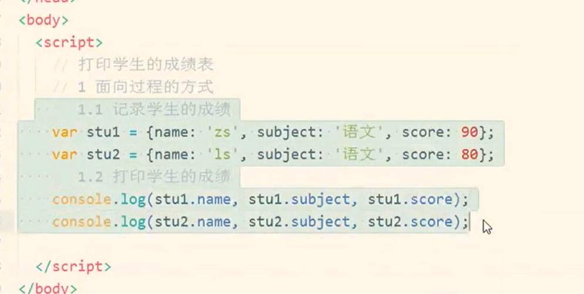
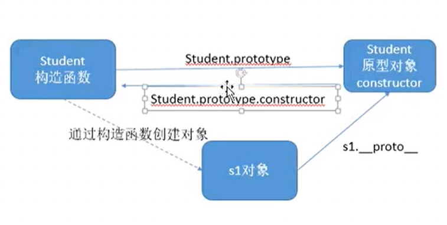

## 目标

- 理解面向对象开发思想
- 掌握 `JavaScript` 面向对象开发相关模式
- 掌握 `JavaScript` 中使用正则表达式

**案例演示**

- 贪吃蛇

<!--more-->

## `JavaScript ` 执行过程

- 预解析
  - 全局预解析（所有变量和函数声明都会提前：同名的函数和变量函数的优先级高）
  - 函数内部预解析（所有的变量、函数和形参都会参与预解析）
    - 函数
    - 形参
    - 普通函数
- 执行

> 先预解析全局作用域，然后执行全局作用域中的代码。
>
> 在执行全局的过程中遇到函数调用就会先执行函数预解析，然后再执行函数内代码。

## 对象介绍

> 对象是一个容器，封装了属性（**property**）和方法（**method**）。

属性是对象的状态，方法是对象的行为（完成某种任务）。

在实际开发中，对象是一个抽象的概念，可以将其简单理解为：**数据集或功能集**。

ECMAScript-262把对象定义为：无序属性的集合，其属性可以包含基本值、对象或者函数。

严格来讲，这就相当于说对象是一组没有特定顺序的值，对象的每个属性或方法都有一个名字，而每个名字都映射到一个值。

提示：每个对象都是基于一个引用类型创建的，这些类型可以是系统内置的原生类型，也可以是开发人员自定义的类型。

### 什么是面向对象

> 面向对象不是新的东西，它只是过程式代码的一种高度封装，目的在于提高代码的开发效率和可维护性。

- 面向对象编程 -- Object Oriented Programming，简称 OOP，是一种编程开发思想。

- 它将真实世界各种复杂的关系，抽象为一个个对象，然后由对象之间的分工与合作，完成对真实世界的模拟。
- 在面向对象程序开发思想中，每一个对象都是功能中心，具有明确分工，可以完成接受信息、处理数据、发出信息等任务。
- 因此，面向对象编程具有灵活性、代码可复用性、高度模块化等特点，容易维护和开发，比起由一系列函数或指令组成的传统的过程式编程（procedural programming），更适合多人合作的大型软件项目。

**面向对象与面向过程：**

- 面向过程就是亲力亲为，事无巨细，面面俱到，步步紧跟，有条不紊
- 面向对象就是找一个对象，指挥得结果
- 面向对象将执行者转变成指挥者
- 面向对象不是面向过程的替代，而是面向过程的封装

**面向对象的特性：**

- 封装性
- 继承性
- 【多态性】抽象

### 代码演示面向对象

**面向过程**



## 构造函数的原型（prototype）

> 每一个构造函数都有一个属性 原型 / 原型对象

```js
function Student(name, age, sex) {
    this.name = name;
    this.age = age;
    this.sex = sex;
}
console.dir(Student.prototype); // object

Student.sayHi = function() {
    console.log('大家好，我是' + this.name);
}

var stu1 = new Student('小明',12,'男');
var stu2 = new Student('小丽',12,'女');
console.log(stu1.sayHi === stu2.sayHi); // true

// 当调用对象的属性或者方法的时候，先去找对象本身的属性/方法
// 如果对象没有该属性或者方法，此时去调用原型中的属性/方法
// 如果对象本身没有该属性/方法，原型中也没有该属性或者方法，此时会报错  -- xx not a function 

// stu1对象的__proto__等于构造函数的Student.prototype
// __proto__属性是非标准的属性
```

## constructor

> 作用记录了创建该对象的构造函数，记录了创建该对象的构造函数

```js
console.log(stu1.constructor === Student);

var arr = [];
console.log(arr.constructor === Array);
```



