# ssr体验：nuxt.js

>  Nust.js是一个基于Vue.js的**通用应用框架**

通过对客户端/服务器基础结构的抽象组织，Nust.js主要关注的是应用的 **UI渲染**

>结论：
>
>1. nuxt不仅仅用于服务端渲染也可用于spa应用开发
>2. 利用nuxt提供的基础项目结构，异步数据加载，中间件支持，布局等特性可大幅提高开发效率
>3. nuxt可用于网站静态化

## nuxt.js特性

- 基于 Vue.js
- 自动代码分层
- 服务端渲染
- 强大的路由功能，支持异步数据
- 静态文件服务
- ES6/ES7语法支持
- 打包和压缩JS和CSS
- HTML头部标签管理
- 本地开发支持热加载
- 集成WDLint
- 支持各种各样预处理器：SASS、LESS、Stylus等等
- 支持HTTP/2推送

> 非常方便做 vue的ssr，创建过程，相当于配置的过程

# Nuxt.js基础

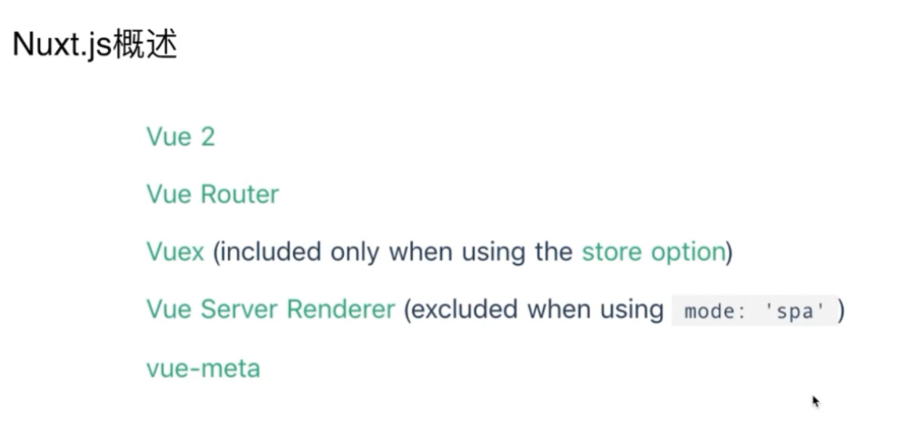

<!--more-->

## Nuxt.js工作流(生命周期)

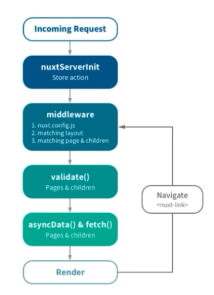

| 名称                           | 描述                                       |
| ---------------------------- | ---------------------------------------- |
| Incoming Request             | 浏览器发出一个请求                                |
| nuxtServerlint（Store action） | 服务端接收到这个请求，要检查有没有nuxtServerlint这个配置项，有的话先执行这个函数 (Store action操作vuex的 ) |
| middleware                   | 中间件相关，任何想做的功能都可以放在这个里面                   |
| validate()                   | 验证，配合高级动态路由做一些验证（是否允许跳转到这个页面来）           |
| asyncData()&fetch()          | 获取数据 （asyncData()的数据用来修改component的，fetch()用来修改vuex的） |
| Render                       | 渲染                                       |
| Navigate                     | 循环                                       |

Nuxt.js安装

```js
vue init nuxt-community/koa-template
```

[github地址](https://github.com/nuxt-community/koa-template)

运行 create-nuxt-app

```js
npx create-nuxt-app <项目名>  /* 好处是执行每次下载最新的nuxt */
```

## Nuxt.js目录

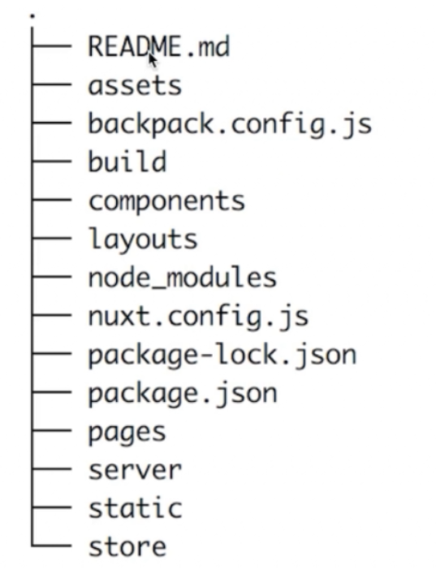

> layout 相当于公共组件（头部），就不用像以前一样，每个页面引入公共组件

## 视图

下图展示了Nuxt.js如何为指定的路由配置数据和视图

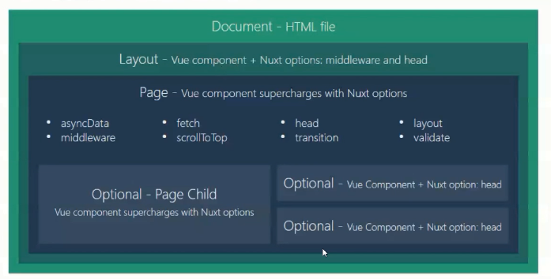

## 路由&示例

**导航**

```js
<nuxt-link to="/users">用户列表</nuxt-link>
```

> 功能和router-link等效

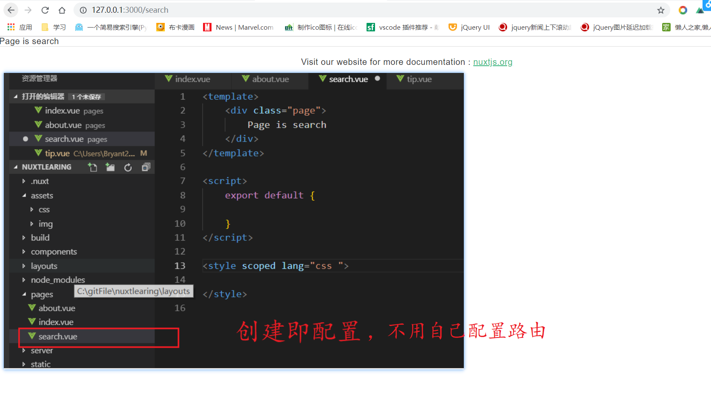

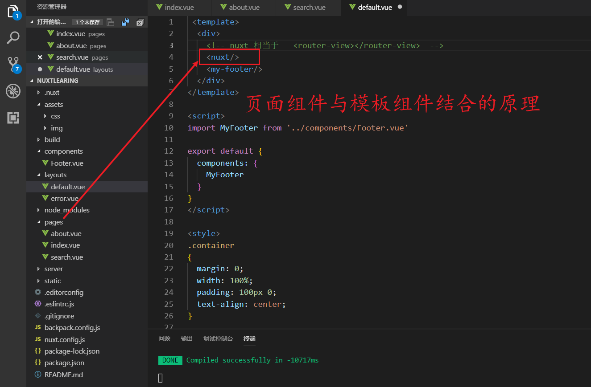

## 页面模板&示例

1. 编写模板

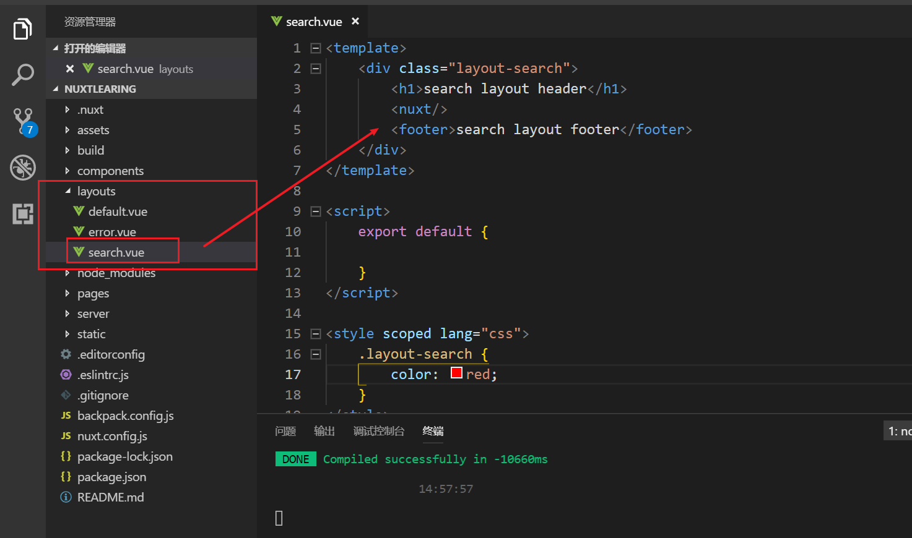

2. 引用模板

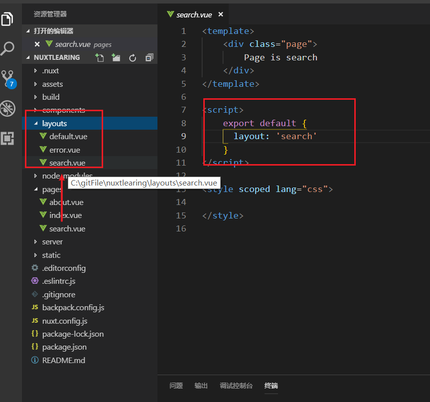

## 异步数据&示例&SSR剖析

1. 在server的目录下创建一个接口文件

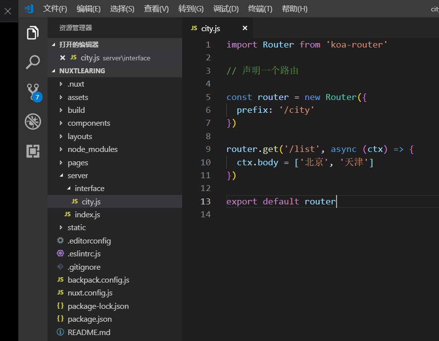

​	配置

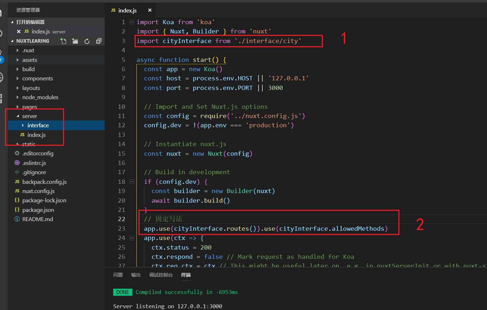

2. 引用接口

```js
<script>
import axios from 'axios'
export default {
  layout: 'search',
  data() {
    return {
      list: [ ]
    }
  },
  async mounted() {
    let self = this
    let { status, data: {list} } = await axios.get('/city/list')
    if (status === 200) {
      self.list = list
    }
  }
}
</script>
```

> mounted在服务器端渲染是不执行这个过程的，只有created才会执行

```js
<script>
import axios from 'axios'
export default {
  layout: 'search',
  data() {
    return {
      list: [ ]
    }
  },
  async asyncData() {
    let { status, data: {list} } = await axios.get('http://localhost:3000/city/list')
    if (status === 200) {
      return {
        list
      }
    }
  }
}
</script>
```

## Vuex应用&示例

文件结构

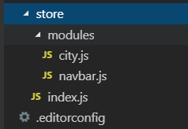

```html
<ul>
  <li
      v-for="(item,index) in $store.state.city.list"
      :key="index"
      >{{item}}</li>
</ul>
```

### The nuxtServerInit Action

 ```js
import Vue from 'vue'
import Vuex from 'vuex'
import city from './modules/city'
import navbar from './modules/navbar'

Vue.use(Vuex)

const store = () => new Vuex.Store({
  modules: {
    city,
    navbar
  },
  actions: {
    nuxtServerInit({ commit }, { req }) {
      if (req.session.user) {
        commit('user', req.session.user)
      }
    }
  }
})

export default store
 ```

## Vue SSR工作原理

### SSR概述

### SSR实现的原理

### Vue SSR的渲染流程

# 实战准备

项目安装

```js
npm install -g npx
```

```js
npx create-nuxt-app project-name
```

