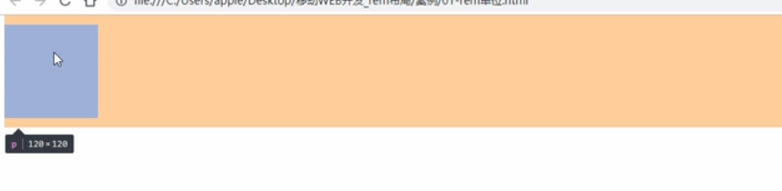
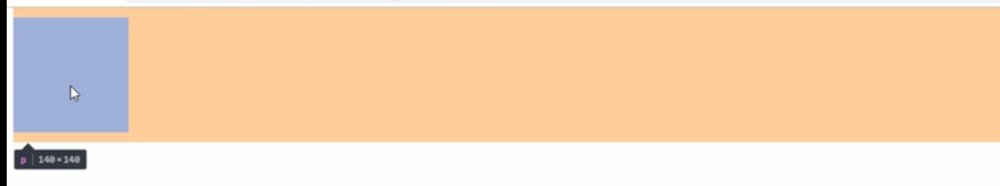
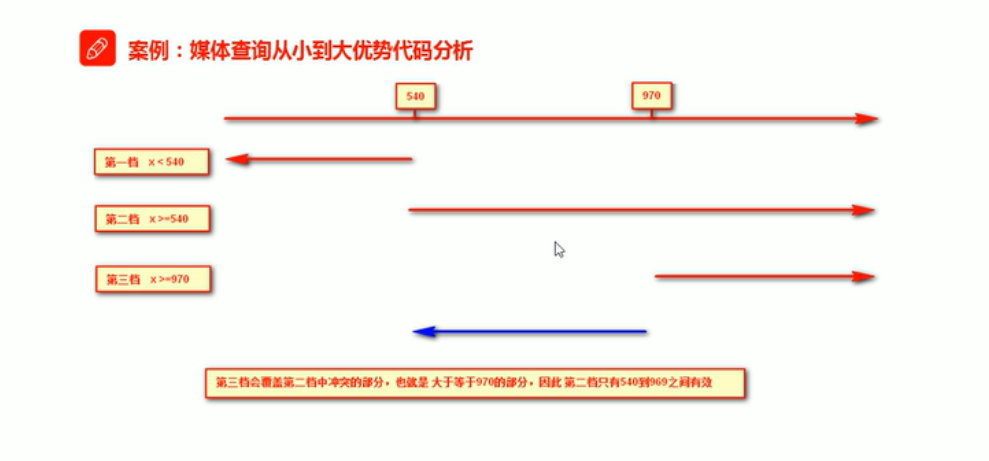
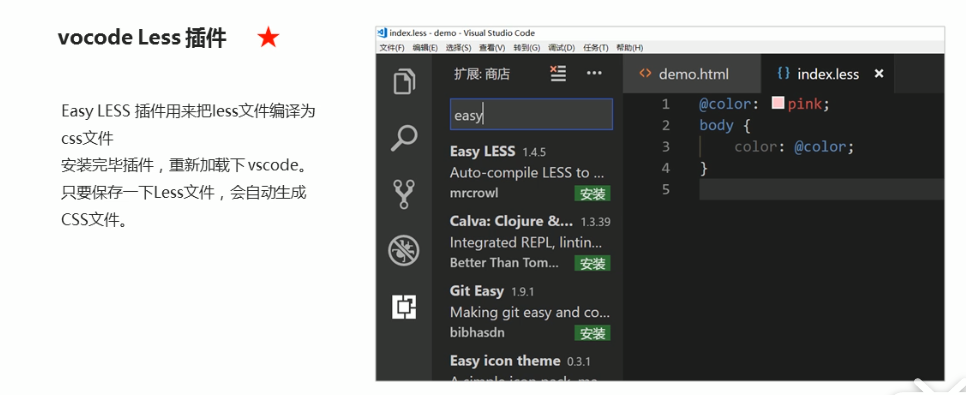
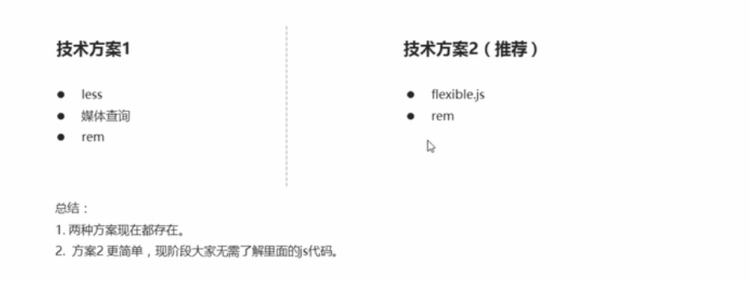
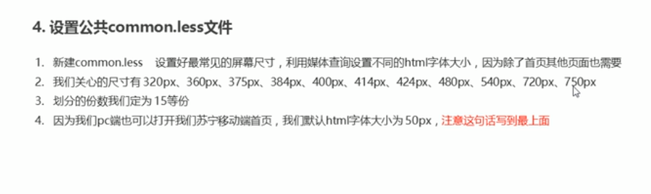

# em基础

> em相对于父元素的字体大小来说的

```html
<style>
    div {
        font-size: 12px;
    }    
    
    p {
        width: 10em;
        height: 10em;
        background-color: pink;
    }
</style>

<body>
    <div>
        <p></p>
    </div >
</body>
```



<!--more-->

# rem基础

rem(root em)是一个相对单位，类似em，em是父元素字体大小。

不同的是**rem**的基准**是**相对于html元素的**字体大小**。

比如，根元素(html)设置font-size=12px；非根元素设置width:2rem；则换成px表示就是24px。

> rem 相对于 html 元素字体大小来说的

```html
<style>
    html {
		font-size: 14px;        
    }
    
    div {
        font-size: 12px;
    }    
    
    p {
        width: 10rem;
        height: 10rem;
        background-color: pink;
    }
</style>

<body>
    <div>
        <p></p>
    </div >
</body>
```



> **rem** 的优点就是可以通过修改 html 里面的文字大小来改变页面中元素的大小，实现整体控制

# 媒体查询语法简介

## 什么是媒体查询( `Media Query` )是 `CSS3` 新语法。

- 使用 @media  查询，可以针对不同的媒体定义不同的样式
- **@media 可以针对不同的屏幕尺寸设置不同的样式**
- 当你重置浏览器大小的过程中，页面也会根据浏览器的宽度和高度重新渲染页面
- 目前针对很多苹果手机、Android手机、平板等设备都用得到很多媒体查询

## 语法规范

```css
@media mediatype and|not|only (media feature) {
    css-Code;
}
```

- 用 @media 开头，注意@符号
- mediatype 媒体类型 （打印机、手机屏幕……）

> 将不同的终端设备划分成不同的类型，称为媒体类型

|    值     | 解释说明                               |
| :-------: | -------------------------------------- |
|    all    | 所有设备                               |
|   print   | 用于打印机和打印预览                   |
| **scree** | **用于电脑屏幕，平板电脑，智能手机等** |

- 关键字 and|not|only

> 关键字将媒体类型或多个媒体特性连接到一起作为媒体查询的条件

| 值   | 解释说明                                         |
| ---- | ------------------------------------------------ |
| and  | 可以将多个媒体特性连接到一起，相当于"且"的意思。 |
| not  | 排除某个媒体类型，相当于"非"的意思，可以省略。   |
| only | 指定某个特点的媒体类型，可以省略。               |

- media feature 媒体特性，必须小括号包含

> 每种媒体类型都具有各自不同的特性，根据不同媒体类型的媒体特性设置不同的展示风格。我们暂且了解三个。注意他们要加小括号包含

| 值        | 解释说明                             |
| --------- | ------------------------------------ |
| width     | 定义输出设备中页面可见区域的宽度     |
| min-width | 定义输出设备中页面最小可见区域的宽度 |
| max-width | 定义输出设备中页面最大可见区域宽度   |

## 示例

```css
/* 这句话的意思就是，在我们屏幕上 并且 最大宽度是800像素,
设置我们想要的样式 */
/* 媒体查询可以根据不同的屏幕尺寸改变不同的样式 */
@media screen and (max-width: 800px) {
    body {
        background-color: pink;
    } 
}
@media screen and (max-width: 500px) {
    body {
        background-color: purple;
    } 
}

/* 540 ~ 970 我们的页面颜色改为绿色 */
@media screen and (min-width: 540px) and (max-width:969px) {
    body {
        background-color: green;
    }
}
/* screen 还有 and 必须带上不能省略 */
```

> 注意：为了防止混乱，媒体查询我们要按照从小到大或从大到小的顺序来写，但是**我们最喜欢的还是从小到大来写，这样代码更简洁**

**样式层叠性**



## 媒体查询+rem实现元素动态大小变化

> rem单位是跟着html来走的，有了rem页面元素可以设置不同的大小尺寸
>
> 媒体查询可以根据不同设备宽度来修改样式
>
> 媒体查询+rem就可以实现不同设备宽度，实现页面元素大小的动态变化

```css
/* html {
    font-size: 100px;
} */

@media screen and (min-width: 320px) {
    html {
        font-size: 50px;
    }
}

@media screen and (min-width: 640px) {
    html {
        font-size: 100px;
    }
}

.top {
    height: 1rem;
    font-size: .5rem;
    background-color: green;
    color: #fff;
}
```

## 引入资源（理解）

> 当样式比较繁多的时候，我们可以针对不同的媒体使用不同 stylesheets（样式表）。
>
> 原理，就是直接在 link 中判断设备的尺寸，然后引用不同的 css 文件。

### 语法规范

```html
/* 引入资源就是，针对于不同的屏幕尺寸，调用不同的css文件 */
<link rel="stylesheet" media="mediatype and|not|only (media feature)" href="mystylesheet.css">

<link rel="stylesheet" href="style320.css" media="screen and (min-width: 320px)">
<link rel="stylesheet" href="style640.css" media="screen and (min-width: 640px)">
```

# Less 基础

> CSS 是一门非程序式语言，没有变量、函数、SCOPE（作用域）等概念。

- CSS 需要书写大量看似没有逻辑的代码，CSS 冗余度是比较高的。
- 不方便维护及扩展，不利于复用。
- CSS 没有很好的计算能力。
- 非前端开发工程师来讲，往往会因为缺少CSS编写经验而很难写出组织良好且易于维护的CSS代码项目。

### Less介绍

Less (Leaner Style Sheets 的缩写) 是一门 CSS 扩展语言，也成为 CSS预处理器。

作为 CSS 的一种形式的扩展，它并没有减少 CSS 的功能，而是在现有的 CSS 语法上，为 CSS 加入程序式语言的特性。

它在 CSS 的语法基础上，引入了变量，Mixin（混入）,运算以及函数等功能，大大简化了 CSS 的编写，并且降低了 CSS的维护成本，就像它的名称说的那样，Less可以让我们用更少的代码做更多的事情。

[Less中文网址](http://lesscss.cn)

常见的CSS预处理器： Sass、Less、Stylus

> 一句话：**Less是一门 css 预处理语言，它扩展了css的动态特性**

1. **Less变量**

> 变量是指没有固定的值，可以改变的。因为我们CSS的一些颜色和数值等经常使用。

```css
@变量名：值；
    1.变量命名规范
    - 必须有@为前缀
    - 不能包含特殊的字符
    - 不能以数字开头
    - 大小写敏感
    
// 定义一个粉色的变量
// 错误的变量名 @1color @color~@#
// 变量名区分大小写 @color 和 @Color 是两个不同的变量    
@color: pink;
@font14: 14px;
body {
    background-color: @color;
    font-size: @font14;
}
```

2. **Less编译**

> 本质上，Less包含一套自定义的语法及一个解析器，用户根据这些语法定义自己的样式规则，这些规则最终会通过解析器，编译生成对应的CSS文件。
>
> 所以，我们需要把我们的less文件，编译生成为css文件，这样我们的html页面才能使用。



3. **Less嵌套**

如果遇见（交集|伪类|伪类选择器）

- 内层选择器的前面没有&符号，则它会解析为夫选择器的后代；
- 如果有&符号，它就被解析为父元素自身或父元素的伪类。

```css
a {
    color: red;
    &:hover {
        color: blue;
    }
}
```

4. **Less运算** ♥

> 任何数字、颜色或者变量都可以参与运算。就是Less提供了（+）、减(-)、乘（*）、除（/）算术运算。

```css
@border: 5px + 5
div {
    width: 200px - 50;
    height: 200px * 2;
    border: @border solid red;
}

img {
    width: 82 / 50rem;
    height: 82 / 50rem;
}

/* Less 甚至还可以这样 */
width: (@width + 5)*2;
// 1.我们运算符的左右两侧必须敲一个空格隔开。
// 2.两个数参与运算，如果只有一个数有单位，则最后的结果以这个单位为准。
// 两个数参与运算，如果2个数都有单位，而且不一样的单位，最后的结果以第一个单位为准。
```

# rem适配方案一♥

1. 我们适配的目标是什么？

- 让一些不能等比自适应的元素，达到当设备尺寸发生改变的时候，等比例适配当前设备。
- 使用媒体查询根据不同设备按比例设置html的字体大小，然后页面元素使用rem做尺寸单位，当html字体大小变化，元素尺寸也会发生变化，从而达到等比例缩放的适配。

2. 怎么去达到这个目标的？

- 按照设计稿与设备宽度的比例，动态计算并设置html根标签的font-size大小；(媒体查询)
- CSS 中，设计稿元素的宽、高、相对位置等取值，按照同等比例换算为rem为单位的值


​	3.在实际的开发当中使用？



## rem + 媒体查询 + less 技术

动态设置html标签font-size大小

1. 假设设计稿是750px
2. 假设我们把整个屏幕划分成为15等分(划分标准不一可以是20份也可以是10等份)
3. 每一份作为html字体大小，这里就是50px
4. 那么在320px设备的时候，字体大小为 320/15 就是 21.33px
5. 用我们页面元素的大小除以不同的html字体大小会发现他们比例还是相同的
6. 比如我们以750为标准设计稿
7. 一个100乘以100像素的页面元素在750屏幕下，就是 100/50 转换为 rem 是 2rem乘以2rem比例是1比1
8. 320屏幕下，html字体大小为21.33，则2rem = 42.66px 此时宽和高都是 42.66 但是，宽和高的比例还是1比1
9. 但是已经实现不同屏幕下，页面元素盒子等比例缩放的效果

```css
@media screen and (min-width: 320px) {
    html {
        font-size : 21.33px;
    }
}

@media screen and (min-width: 750px) {
    html {
        font-size: 50px;
    }
}

div {
    width: 2rem;
    height: 2rem;
    background-color: pink;
}

/*
  1.首先我们选一套标准尺寸 750 为准
  2.我们用屏幕尺寸 除以 我们划分的份数 得到了 html 里面的文字大小，但是我们知道不同屏幕下得到的文字大小是不一样的
  3.页面元素的rem值 = 页面元素在 750 像素下px的值 / html里面的文字大小
*/
```

## 项目common.less

```css
// 设置常见的屏幕尺寸，修改里面的html文字大小
// 我们此次定义的划分的份数为15
// 一定要写在最上面
html {
    font-size: 50px;
}
@no: 15;
// 320
@media screen and (min-width:320px) {
    html {
        font-size: 320px / @no;
    }
}
// 360
@media screen and (min-width:360px) {
    html {
        font-size: 360px / @no;
    }
}
// 375 iphone 678
@media screen and (min-width:375px) {
    html {
        font-size: 375px / @no;
    }
}
```



**面试点：**

```css
// @import "common"
// @import 导入的意思，可以把一个样式文件导入到另一个样式文件里面
// link 是把一个样式文件引入到html页面里面
```

# rem适配方案二（推荐）♥

## 简洁高效的rem适配方案flexible.js

> 手机淘宝团队出的简洁高效移动端适配库
>
> 我们再也不需要再写不同的屏幕的媒体查询，因为里面js做了处理
>
> 它的原理是把当前设备划分成10等份，但是不同设备下，比例还是一致的。
>
> 我们要做的，就是确定好我们当前设备的html文字大小就可以了
>
> 比如当前设计稿是750px，那么我们只需要把html文字大小设置为75px(750px/10)就可以
>
> 里面页面元素rem值:页面元素的px值/75
>
> 剩余的，让flexible.js来去算

[github地址](https://github.com/amfe/lib-flexible)

## VSCode px 转换rem插件 **cssrem**

设置html字体大小基准值

1. 打开设置 快捷键是 ctrl+ 逗号 

## 修改flexible默认html字体大小

```css
/* 如果我们屏幕超过了 750px，那么我们就按照 750 设计稿来走，不会让我们页面超过750px */
@media screen and (min-width:750px) {
    html {
        font-size: 75px!important;
    }
}
```

