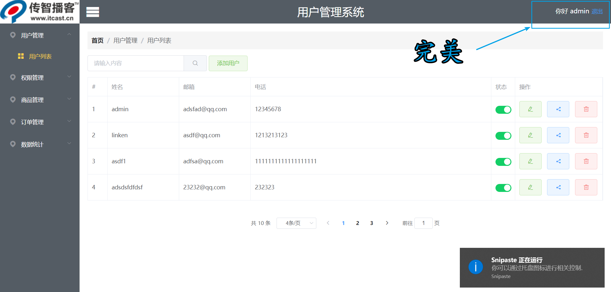

[官方文档](https://vuex.vuejs.org/zh/guide/)

# 开始Vuex

## 安装

```node
npm install vuex -save
```

## 描述

**每一个 Vuex 应用的核心就是 store （仓库）。”store“ 基本上就是一个容器，它包含着你的应用中大部分的状态（state）。Vuex 和单纯的全局对象有以下两点不同：**

1. Vuex 的状态存储是响应式的。当 Vue 组件从 store 中读取状态的时候，若 store 中的状态发生变化，那么相应的组件也会相应地得到高效更新。
2. 你不能直接改变 store 中地状态。改变 store 中的状态的唯一途径就是显示地提交（commit）mutation 。这样使得我们可以方便地跟踪每一个状态的变化，从而让我们能够实现一些工具帮助我们更好地了解我们地应用。

## 视图帮助理解


<!--more-->

## 最简单的 Store.js文件

```js
import Vue from 'vue'
import Vuex from 'vuex'

// 让vue使用vuex工具来实现组件之间的数据共享
Vue.use(Vuex)

const state = {}
const mutations = {}
const actions = {}
const getters = {}

export default new Vuex.Store({
  strict:true,
  state,
  getters,
  actions,
  mutations
})
```

| 参数            | 描述                                       |
| ------------- | ---------------------------------------- |
| **state**     | **使用vuex数据是存储在state中，意味着所有你的想操作的数据都存储在这个对象中** |
| **mutations** | **mutations里面定义着操作State中数据的函数，通过这个函数我们可以自由的操作数据** |
| **actions**   | **actions里面存储着触发mutations里面的函数的行为(函数)**  |
| **getters**   | (**属性封装**)**可以来获取State中的数据**             |
| **strict**    | **如果添加了严格模式，那么直接修改state中的数据会报错**         |

## 一阶代码

**store.js**

```js
import Vue from 'vue'
import Vuex from 'vuex'


// 让vue使用vuex工具来实现组件之间的数据共享
Vue.use(Vuex)


// 存储数据的对象，我们可以将你需要存储的数据在这个state中定义
const state = {
  username:''
}
const mutations = {
  setUserName (state,username) {
    state.username = username
  },
  getUserName (state) {
    return state.username
  }
}
const actions = {
  setUserNameAction:({commit},username)=>{
    commit('setUserName',username)
  },
  getUserNameAction:({commit})=>{
    commit('getUserName')
  }
}
const getters = {}


export default new Vuex.Store({
  strict:true,
  state,
  getters,
  actions,
  mutations
})
```

**存值：**

```js
this.$store.dispatch('setUserNameAction',res.data.username)
```

**取值：**

```html
<span class="welcome">
  你好 {{$store.state.username}}
</span>
```


**bug:**


## 二阶代码（解决bug）

**store.js**

```js
import Vue from 'vue'
import Vuex from 'vuex'


// 让vue使用vuex工具来实现组件之间的数据共享
Vue.use(Vuex)


// 存储数据的对象，我们可以将你需要存储的数据在这个state中定义
const state = {
  username:''
}
const mutations = {
  setUserName (state,username) {
    state.username = username
    localStorage.setItem('myname',username)
  },
  getUserName (state) {
    return state.username
  }
}
const actions = {
  setUserNameAction:({commit},username)=>{
    commit('setUserName',username)
  },
  getUserNameAction:({commit})=>{
    commit('getUserName')
  }
}
const getters = {
  getUserName:(state)=>{
    return localStorage.getItem('myname')
  }
}


export default new Vuex.Store({
  strict:true,
  state,
  getters,
  actions,
  mutations
})
```

**存值：**

```js
this.$store.dispatch('setUserNameAction',res.data.username)
```

**读取值：**

```html
<span class="welcome">
  你好 {{$store.getters.getUserName}}
</span>
```



### getters

> 有时候我们需要从 store 中的 state 中派生出一些状态，我们可以理解为 vuex 中数据的 computed  功能

**store.js**

```js
getters: {
    money: state => `￥${state.count*1000}`
}
```

**page1.vue**

```js
computed: {
    money() {
        return this.$store.getters.money
    }
}
```

# vuex在页面刷新后数据丢失的问题

## 原因

js代码是运行在内存中的，代码运行时的所有变量、函数也都是保存在内存中的。

> Vuex就是一个“提升变量”的一个工具，它是将state当做全局变量存储。F5刷新页面之后自然随着页面的刷新重新初始化state.

## 解决

刷新页面，以前申请的内存被释放，重新加载脚本代码，变量重新赋值，所以这些数据要想存储就必须存储在外部，例如：Local Storage、Session Storage、Index DB等。这些都是浏览器提供的API，让你可以将数据存储在硬盘上，做持久化存储。具体选择哪一个就根据你实际需求来选择。