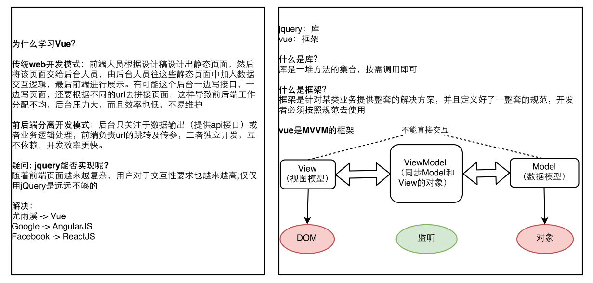

# 为什么要学习Vue

> vue 的核心是减少页面渲染的次数和数量



# 什么是MVVM


<!--more-->

# 官方网站

[Vue.js](https://cn.vuejs.org/v2/api/)

# Hello World

```js
<!DOCTYPE html>
<html lang="en">
<head>
    ……
    <!-- 1. 引入 vue 文件 -->
    <script src="./js/vue2.js"></script>
</head>
<body>
    <div id="app">
        <span>{{msg}}</span>
    </div>
    <script>
        /* 2. 创建 vue 实例，作用，他会监管我们的html代码 */    
        var vm = new Vue({
            /* 3. 通过一个 el 属性来指定 vue 实例的监管范围，后面跟一个 id */
            el:'#app',
            /* 4. 用 data 属性将要展示的变量存起来， data 后面跟一个对象 */
            data:{
                msg:'hello world'
            }
        })
    </script>
</body>
</html>
```

# ref

> ref的作用类似于document.getElementByID,在vue中想要获取一个dom对象或者组件对象，则只需要 在此元素上添加一个 ref="自定义名称" ，再使用 this.$refs.自定义名称即可获取

```html
<div id="app">
  <input type="text" ref='goodsId'>
</div>
<script>
    var vm = new Vue({
      el: '#app',
      data: {

      },
      // mounted:页面加载完毕之后就会自动执行的函数.相当于window.onload
      // 生命周期的内容
      mounted() {
        // 在vue中，可以通过$refs来获取之前通过ref标识的dom成员
        // $refs是当前vm实例的内置成员
        // this.$refs是一个对象，里面就存储着之前所有通过ref设置标识的dom元素
        this.$refs.goodsId.focus()
      }
    })
</script>
```

