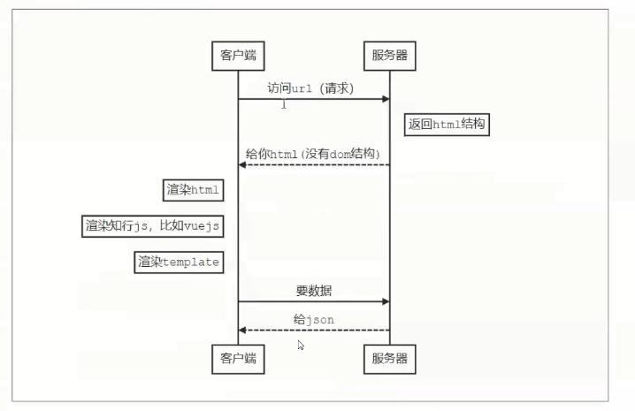

## 传统的web开发


```js
// npm i express -s
const express = require('express')
const app = express()

app.get('/',function(req,res){
    res.send(`
		<html>
			<div>
				<div id="app">
					<h1>金州勇士</h1>
					<p>史蒂芬库里</p>
				</div>
			</div>
		</html>
	`)
})

app.listen(3000, () => {
    console.log('启动成功')
})
```

<!--more-->

## SPA时代

> 到了 vue , react 时代，单页面应用优秀的用户体验，逐渐成为了主流，页面整体是JS渲染出来的，称之为客户端渲染 **CSR**




这里可以看到单页面应用的两个缺点

1.  **首屏渲染等待长**：必须得等js加载完毕，并且执行完毕，才能渲染出首屏
2. **seo不友好**：爬虫只能拿到一个div，认为页面是空的，不利于seo

## SSR 

为了解决这两个问题，出现了 ssr 解决方案，后端渲染出**完整的首屏的 dom 结构返回**，前端拿到的内容带上首屏，后续的页面操作，再用单页的路由跳转和渲染，称之为服务端渲染(sercer side render)

